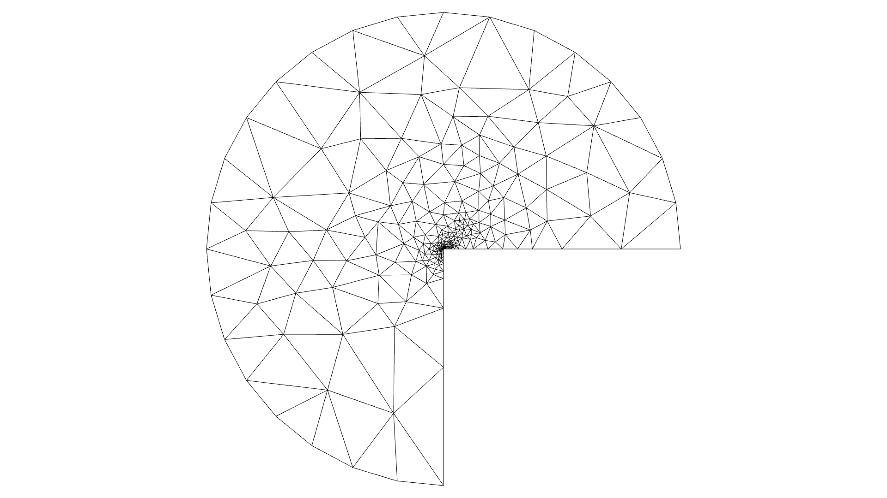
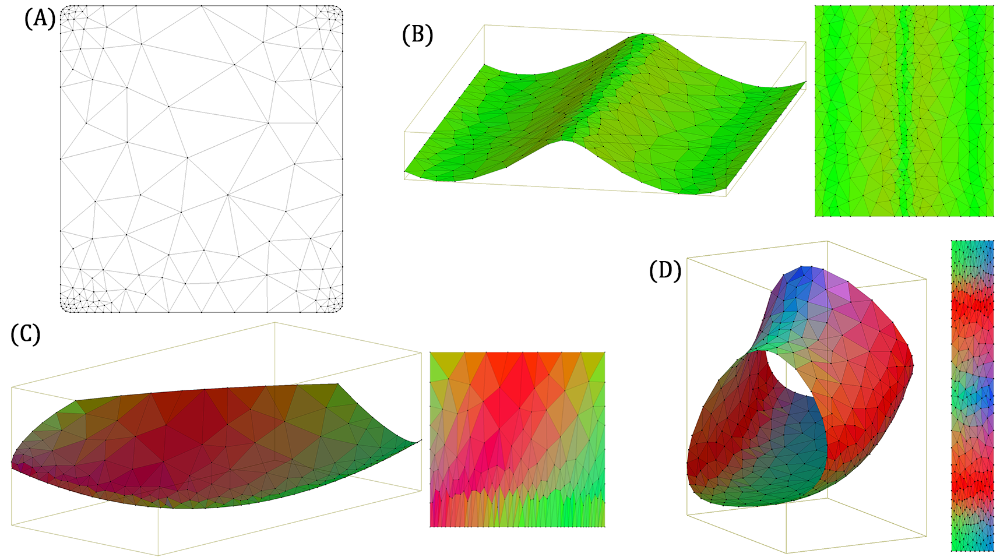
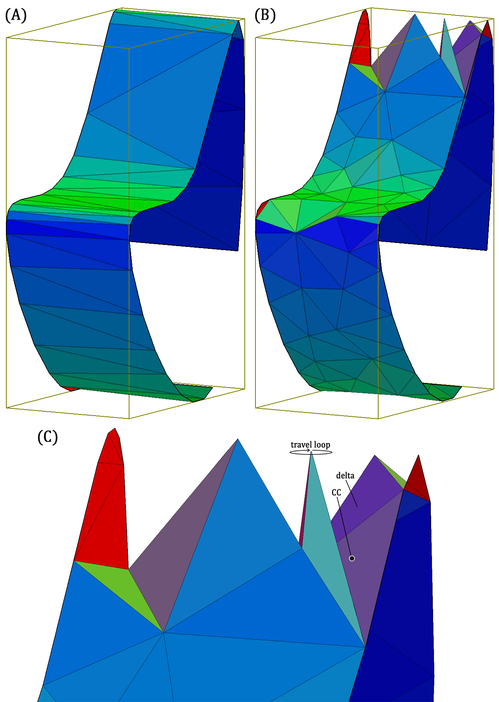
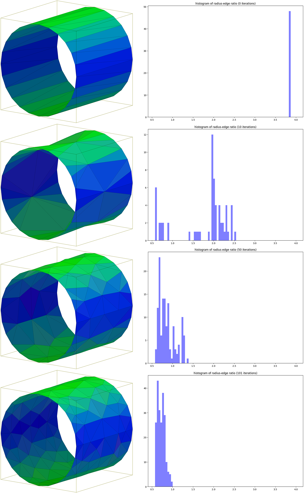
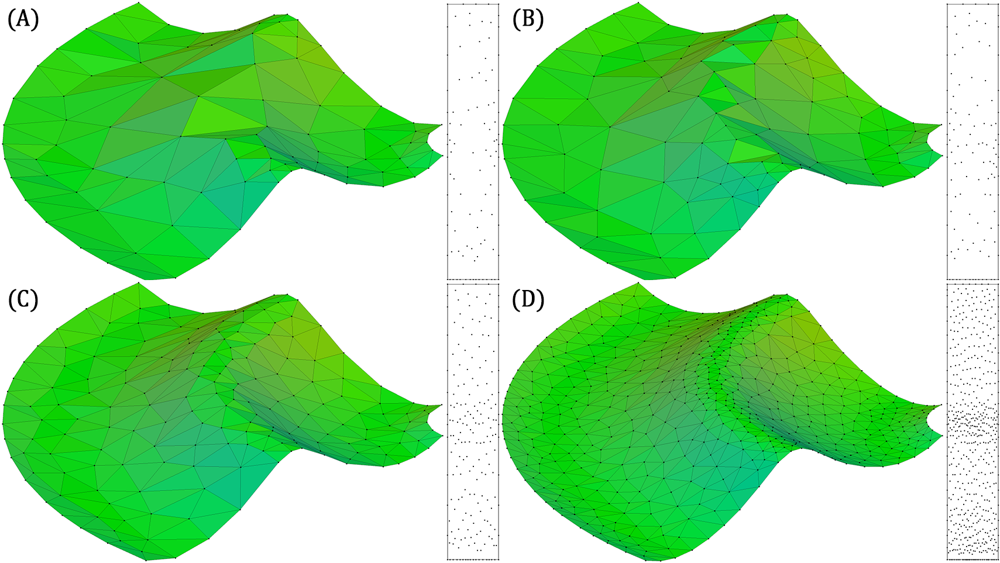
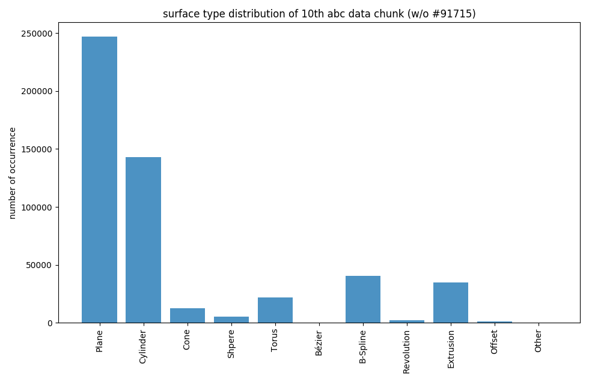

# Prototypes
The various Python modules in this repository are partly dependent and partly independent on one another. They contain all the Python code I program during my thesis on Delaunay Refinement of smooth surface domains embedded into 3-dimensional space.

Dependencies:
- [pythonOCC](https://github.com/tpaviot/pythonocc)
- [pytriangle](https://github.com/pletzer/pytriangle)
- [pyglet](http://pyglet.org)
- [OpenMesh](https://openmesh-python.readthedocs.io/en/latest/)
- [gerobust](https://github.com/aluriak/gerobust)

## Results

